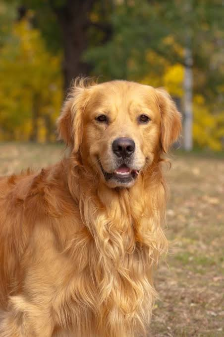

# SqueezeNet PyTorch

## 1. Project Overview

SqueezeNet PyTorch is an image classification project developed using the **PyTorch deep learning framework**.

The project implements the **SqueezeNet Convolutional Neural Network (CNN)** architecture and uses pretrained **ImageNet weights** to classify input images.

The main purpose of this project is to understand how a lightweight CNN can be implemented, how pretrained weights can be loaded, how an image can be processed, and how the model can generate a classification result with a confidence score.

### Complete Pipeline

```text
Input Image
     ↓
Image Preprocessing
     ↓
Tensor Conversion
     ↓
SqueezeNet Model
     ↓
Pretrained ImageNet Weights
     ↓
Feature Extraction
     ↓
Classification
     ↓
Predicted Object
     ↓
Confidence Score
```

For the sample image used in this project, the model predicted:

```text
Golden Retriever
Confidence: 98.17%
```

---

## 2. Problem Statement

Image classification is an important computer vision task in which a deep learning model identifies the main object present in an image.

Large CNN architectures can require significant computational resources and memory.

This project focuses on implementing **SqueezeNet**, a lightweight CNN architecture designed to achieve good classification performance with fewer parameters.

The project demonstrates how a pretrained SqueezeNet model can be used to classify an input image using ImageNet classes.

---

## 3. Objectives

The main objectives of this project are:

- To understand the SqueezeNet CNN architecture.
- To implement SqueezeNet using PyTorch.
- To understand the Fire Module.
- To use pretrained ImageNet weights.
- To preprocess input images.
- To perform image classification.
- To obtain the predicted class.
- To calculate prediction confidence.
- To test the complete inference pipeline.
- To understand the complete project structure.
- To upload and document the project using GitHub.

---

## 4. What is SqueezeNet?

SqueezeNet is a lightweight Convolutional Neural Network designed primarily for image classification.

It was designed to achieve competitive classification accuracy while using significantly fewer parameters than many traditional CNN architectures.

The key component of SqueezeNet is the **Fire Module**.

A Fire Module consists of:

- Squeeze layer
- 1×1 expand convolution
- 3×3 expand convolution

### Fire Module

```text
                 Input
                   |
                   v
             Squeeze Layer
                 1 × 1
                   |
             +-----+-----+
             |           |
             v           v
        Expand 1×1    Expand 3×3
             |           |
             +-----+-----+
                   |
                   v
              Concatenate
                   |
                   v
                 Output
```

The squeeze layer reduces the number of input channels before the expand layers process the features.

This helps reduce the number of parameters and computational requirements.

---

## 5. Why SqueezeNet?

SqueezeNet was selected because it is a lightweight CNN architecture.

### Advantages of SqueezeNet

- Small model size.
- Fewer parameters.
- Lower memory requirements.
- Efficient computation.
- Suitable for resource-constrained environments.
- Supports pretrained ImageNet weights.
- Can be adapted for custom classification.
- Easy to implement using PyTorch.

---

## 6. System Architecture

The overall system architecture is:

```text
                    Input Image
                         |
                         v
                Image Preprocessing
                         |
                         v
                  Resize 224×224
                         |
                         v
                   RGB Conversion
                         |
                         v
                    Normalization
                         |
                         v
                  PyTorch Tensor
                         |
                         v
                  SqueezeNet CNN
                         |
                         v
                   Fire Modules
                         |
                         v
                Feature Extraction
                         |
                         v
                ImageNet Classifier
                         |
                         v
                 1000 Class Scores
                         |
                         v
                Highest Score Class
                         |
                         v
                 Object Name Mapping
                         |
                         v
                Confidence Calculation
                         |
                         v
                       Result
```

---

## 7. Project Workflow

The complete project follows the following workflow:

### Step 1 – Input Image

An image is provided to the system.

### Step 2 – Image Loading

The image is loaded using the Pillow library.

### Step 3 – Image Preprocessing

The image is:

- Converted to RGB.
- Resized to 224 × 224.
- Converted into a PyTorch tensor.
- Normalized.

### Step 4 – Model Creation

The SqueezeNet model architecture is created using PyTorch.

### Step 5 – Weight Loading

The pretrained ImageNet weights are loaded into the model.

### Step 6 – Inference

The processed image is passed through the SqueezeNet network.

### Step 7 – Classification

The model generates scores for 1000 ImageNet classes.

### Step 8 – Prediction

The class with the highest score is selected.

### Step 9 – Confidence

The confidence of the prediction is calculated.

### Step 10 – Result

The predicted object and confidence score are displayed.

---

## 8. Technologies Used

### Programming Language

```text
Python
```

### Deep Learning Framework

```text
PyTorch
```

### Image Processing

```text
Pillow
```

### Numerical Computing

```text
NumPy
```

### Development Environment

```text
Visual Studio Code
```

### Version Control

```text
Git
```

### Repository Hosting

```text
GitHub
```

---

## 9. Project Structure

```text
SqueezeNet-PyTorch/
│
├── data/
│
├── figure/
│
├── results/
│   └── pretrained_models/
│       └── squeezenet1_0-b66bff10.pth
│
├── samples/
│   └── test.jpg
│
├── scripts/
│
├── .gitignore
├── README.md
├── check_weights.py
├── config.py
├── dataset.py
├── image.png
├── imgproc.py
├── inference.py
├── model.py
├── requirements.txt
├── test.py
├── train.py
├── utils.py
└── weight_check.txt
```

---

## 10. File Descriptions

| File / Folder | Purpose |
|---|---|
| `model.py` | Defines the SqueezeNet model architecture |
| `imgproc.py` | Performs input image preprocessing |
| `inference.py` | Performs image classification |
| `dataset.py` | Handles image and label information |
| `config.py` | Stores project configuration |
| `utils.py` | Contains helper functions |
| `train.py` | Contains training-related functionality |
| `test.py` | Tests whether the model works correctly |
| `check_weights.py` | Checks pretrained model weights |
| `requirements.txt` | Contains required Python libraries |
| `weight_check.txt` | Stores weight verification information |
| `image.png` | Project/output image |
| `samples/` | Contains sample images |
| `results/` | Contains pretrained model and results |
| `README.md` | Contains project documentation |

---

## 11. Dataset

The `dataset.py` file handles image and label information.

The project uses the class structure supported by the pretrained ImageNet model.

### Dataset Example

```python
data = [
    {
        "image": "image.png",
        "label": 207
    }
]
```

Here:

- `image` represents the input image.
- `label` represents the corresponding class index.

The dataset module provides the required image and label information to the project.

---

## 12. Image Preprocessing

Before an image is passed to SqueezeNet, it must be converted into the format expected by the model.

The preprocessing process is:

```text
Original Image
      ↓
RGB Conversion
      ↓
Resize
224 × 224
      ↓
Tensor Conversion
      ↓
Normalization
      ↓
Batch Dimension
      ↓
Model Input
```

The final input tensor has the shape:

```text
[1, 3, 224, 224]
```

Where:

```text
1   → Batch size
3   → RGB channels
224 → Image height
224 → Image width
```

The preprocessing functionality is implemented in:

```text
imgproc.py
```

---

## 13. SqueezeNet Architecture

The SqueezeNet architecture is implemented in:

```text
model.py
```

The model consists of convolutional layers and Fire Modules.

### Basic Architecture

```text
Input Image
     ↓
Initial Convolution
     ↓
Fire Module
     ↓
Fire Module
     ↓
Fire Module
     ↓
Fire Module
     ↓
Fire Module
     ↓
Fire Module
     ↓
Final Convolution
     ↓
Global Average Pooling
     ↓
Classification Output
```

SqueezeNet uses Fire Modules to reduce the number of parameters while still extracting useful image features.

---

## 14. Fire Module

The Fire Module is the main building block of SqueezeNet.

It consists of a squeeze layer followed by expand layers.

```text
                  Input
                    |
                    v
              Squeeze 1×1
                    |
            +-------+-------+
            |               |
            v               v
       Expand 1×1       Expand 3×3
            |               |
            +-------+-------+
                    |
                    v
               Concatenate
                    |
                    v
                  Output
```

### Squeeze Layer

The squeeze layer uses a 1×1 convolution to reduce the number of channels.

### Expand Layers

The expand section contains:

```text
1×1 convolution
3×3 convolution
```

The outputs from both expand layers are concatenated.

This design helps SqueezeNet maintain useful feature extraction while keeping the model lightweight.

---

## 15. Pretrained Weights

The project uses pretrained SqueezeNet weights.

The pretrained weights were learned using the ImageNet dataset.

The model supports:

```text
1000 ImageNet Classes
```

The pretrained model file is stored inside:

```text
results/pretrained_models/
```

Example:

```text
squeezenet1_0-b66bff10.pth
```

The weights are loaded into the SqueezeNet model before performing inference.

Using pretrained weights avoids the need to train the entire model from scratch for this demonstration.

---

## 16. Model Input and Output

### Model Input

The processed image is provided to the model as:

```text
[1, 3, 224, 224]
```

Where:

```text
1 = Batch size
3 = RGB channels
224 = Height
224 = Width
```

### Model Output

The model generates scores for:

```text
1000 ImageNet Classes
```

The output shape is:

```text
[1, 1000]
```

The highest-scoring class is selected as the final prediction.

---

## 17. Inference Process

Inference is the process of using the pretrained model to classify a new image.

The inference functionality is implemented in:

```text
inference.py
```

### Inference Pipeline

```text
Load Image
     ↓
Preprocess Image
     ↓
Load SqueezeNet
     ↓
Load Pretrained Weights
     ↓
Pass Image Through Model
     ↓
Generate Class Scores
     ↓
Select Highest Score
     ↓
Map Class Index
     ↓
Calculate Confidence
     ↓
Display Result
```

### Sample Result

```text
Object: Golden Retriever
Confidence: 98.17%
```

---

## 18. How to Install

### Step 1 – Open the Project

Open the `SqueezeNet-PyTorch` folder in Visual Studio Code.

### Step 2 – Open Terminal

In VS Code:

```text
Terminal → New Terminal
```

### Step 3 – Activate Virtual Environment

```powershell
.venv\Scripts\Activate.ps1
```

After activation, the terminal should show:

```text
(.venv)
```

### Step 4 – Install Required Libraries

Run:

```powershell
python -m pip install -r requirements.txt
```

The required libraries are:

```text
torch
Pillow
numpy
```

---

## 19. How to Run

After installing the required libraries, the project can be executed using the following commands.

### Test the Model

```powershell
python test.py
```

Expected output:

```text
SqueezeNet is working correctly.
```

### Run Image Classification

```powershell
python inference.py
```

Expected output:

```text
Object: Golden Retriever
Confidence: 98.17%
```

The inference command performs the complete classification process.

---

## 20. Testing

The project was tested at different stages.

### Model Testing

Command:

```powershell
python test.py
```

Output:

```text
SqueezeNet is working correctly.
```

This confirms that the SqueezeNet model implementation is working correctly.

### Inference Testing

Command:

```powershell
python inference.py
```

Output:

```text
Object: Golden Retriever
Confidence: 98.17%
```

This confirms that the complete inference pipeline successfully processes the image and produces a classification result.

### Weight Verification

The project also contains:

```text
check_weights.py
```

and:

```text
weight_check.txt
```

These are used to verify the pretrained model weights.

---

## 21. Output

The model successfully classified the sample input image.

### Output

```text
Object: Golden Retriever
Confidence: 98.17%
```

### Output Image



The output image is included in the repository as:

```text
image.png
```

---

## 22. Result Analysis

The model successfully processed the input image and identified the object.

### Final Prediction

```text
Predicted Object : Golden Retriever
Confidence       : 98.17%
```

The high confidence score indicates that the pretrained SqueezeNet model strongly associated the input image with the Golden Retriever class.

The complete pipeline worked successfully:

```text
Image Input
     ↓
Preprocessing
     ↓
Tensor Conversion
     ↓
SqueezeNet
     ↓
Pretrained Weights
     ↓
Prediction
     ↓
Confidence
     ↓
Final Result
```

---

## 23. Advantages and Limitations

### Advantages

- Lightweight CNN architecture.
- Smaller model size.
- Fewer parameters.
- Lower memory requirements.
- Uses pretrained weights.
- Fast inference.
- Easy to implement using PyTorch.
- Suitable for experimentation.
- Can be extended to custom datasets.

### Limitations

- The pretrained model is limited to ImageNet classes.
- Custom classes require additional training or fine-tuning.
- The current project performs image classification.
- It does not perform object detection.
- It does not generate bounding boxes.
- Prediction quality depends on the input image.
- The current implementation is primarily a classification demonstration.

---

## 24. Future Scope

The project can be extended in several ways.

### Custom Dataset

The SqueezeNet model can be fine-tuned using a custom labelled dataset.

### Real-Time Classification

A webcam can be integrated to perform real-time image classification.

### Graphical User Interface

A GUI can be developed so users can upload images and directly view predictions.

### Web Application

The model can be deployed using:

```text
Flask
FastAPI
Streamlit
```

### Performance Evaluation

Additional evaluation metrics can be added:

```text
Accuracy
Precision
Recall
F1-Score
Confusion Matrix
```

### Edge Deployment

Because SqueezeNet is lightweight, it can be explored for deployment on edge and resource-constrained devices.

---

## 25. Conclusion

This project successfully demonstrates an end-to-end image classification system using **SqueezeNet and PyTorch**.

The project begins with an input image and performs the required preprocessing operations. The processed image is then passed through the SqueezeNet architecture using pretrained ImageNet weights.

The model generates prediction scores for 1000 ImageNet classes. The class with the highest score is selected as the final prediction.

For the sample image used in this project, the model successfully predicted:

```text
Object     : Golden Retriever
Confidence : 98.17%
```

### Final Project Status

```text
Model Implementation : Completed
Image Preprocessing  : Completed
Pretrained Weights   : Loaded
Model Testing        : Passed
Inference            : Passed
Output Generation    : Successful
GitHub Repository    : Completed
```

### GitHub Repository

https://github.com/haripriya7864/SqueezeNet-PyTorch

---

## Final Result

```text
Model              : SqueezeNet
Framework          : PyTorch
Dataset            : ImageNet
Number of Classes  : 1000
Input Size         : 224 × 224

Prediction         : Golden Retriever
Confidence         : 98.17%
```